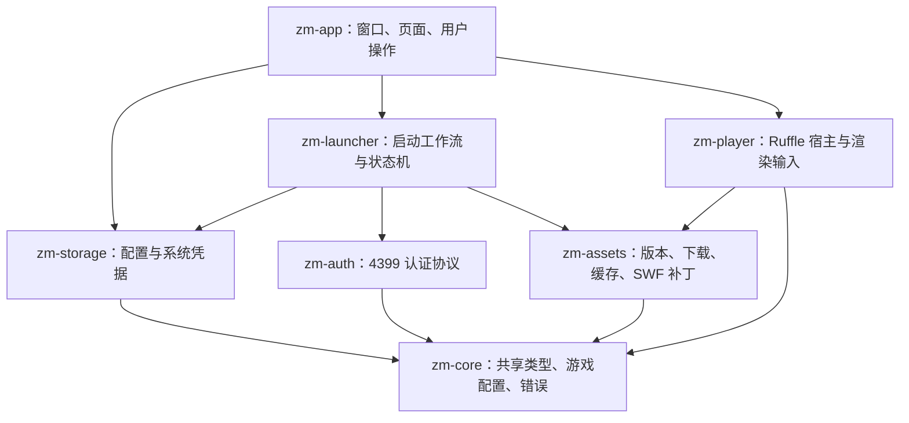

# Rust 客户端架构

本次重新组织应用，不沿用 zmBox 的 AIR / PureMVC 架构。保留 Rust、egui 与内嵌 Ruffle，先建立可独立测试的启动流程和明确的运行时边界。首版范围为造四、造五，单个活动游戏会话；目标平台为 Linux 和 Windows。

## 模块职责

- `zm-app` 的入口只负责日志、图标和窗口创建。`application` 负责事件接入和状态投影，`views` 负责界面，`accounts` 负责账号操作，`theme` 负责视觉样式。
- `zm-launcher` 不依赖 egui / Ruffle。`prepare_launch` 接受 `AuthClient`、`AssetManager` 接口，通过 `LaunchEvent` 交付验证码、阶段变化、启动结果或错误。测试替身不访问真实账号。
- `zm-core` 不再依赖文件系统配置实现、密钥环或 HTTP 库。`GameKind::profile()` 是资源根地址、桥接类、版本发现目录和服务器的共同来源。
- `zm-storage` 维护配置和凭据实现。凭据服务通过队列按提交顺序执行保存、读取、删除，防止保存结果晚于删除。系统密钥环的同步调用由 `spawn_blocking` 执行；Linux 使用 XDG，Windows 使用系统配置和本地数据目录。
- `zm-player` 持有游戏实例，在 UI 线程推进 AVM 与渲染。网络使用应用提供的同一个 Tokio runtime handle；不再创建第二个独立 runtime。

## 启动和退出

`Authenticating → AwaitingCaptcha / PreparingAssets → CreatingPlayer → AwaitingHost → AwaitingSession → SessionApplied`。

验证码阶段回到账号表单；验证码重试复用该次认证上下文。重新选择账号、游戏、取消或重新启动都会使原会话编号失效。异步任务同时被中止；即使结果已经排队，控制器仍拒绝旧编号。验证码图片另带刷新编号，旧图片不能覆盖新图片。

播放器事件同样携带启动会话编号。宿主回调可能重入，状态机允许会话确认早于宿主通知到达，但不允许后来的宿主通知把已注入状态倒退。`HostReady` 仅表示宿主安装完成，`SessionApplied` 仅表示已派发登录事件，均不承诺所有游戏模块可用。启动看门狗以资源完成和初始化进展为依据，连续 90 秒无进展才停止；每次 tick 后先处理新事件，再判断超时。Ruffle 脚本执行上限显式设置为 15 秒，开发构建也不再无限等待脚本。

停止游戏时先保留脱敏诊断，再使启动任务失效并释放播放器纹理。播放器持有本地异步任务句柄，停止时取消并在原线程完成销毁，避免 detached 任务残留。上一会话的日志缓冲和敏感值集合不与下一会话复用。新会话继续按 SWF 帧率推进；没有增加倍速或修改游戏奖励状态。

## 凭据与持久化

每次新的登录使用独立 Cookie Jar；提交验证码时复用原 Jar。认证不再先用已有 Cookie 尝试绕过密码认证。登录账号名与展示名称在启动参数中分别传递，令牌刷新使用真实账号名。

密码、token、Cookie 不进入配置结构，敏感请求与会话类型不自动派生 Debug。内存凭据优先于密钥环读取，避免密钥环写入失败时重新读出旧密码。取消记住密码时会尝试删除原系统凭据，错误向用户展示。

配置以同目录唯一临时文件原子替换。敏感信息通过结构边界隔离，不再用字符串搜索拒绝名字中包含 `token` 或 `cookie` 的合法账号。读取失败不会静默覆盖旧配置；该次运行禁用配置写入。

游戏 SharedObject 位于应用 **数据目录** 的 `ruffle/shared-objects/<game>/<uid>/`，不随资源清理删除，也不在不同账号之间共享。重构不自动导入旧版共享缓存目录中的 SharedObject。

## 资源一致性

主文件写入 `versions/<sha256>.swf`，然后原子发布 `manifest.toml`。清单包含影片 URL、补丁版本、桥接哈希和内容哈希。版本发现或更新失败时，只有与当前补丁一致且哈希校验通过的缓存可以恢复。

资源目录按版本、补丁版本和桥接哈希隔离；相同资源请求共享锁，失效锁条目回收。清理持有排他锁，发布持有读锁和资源锁。原子写入任务持有这些锁直到结束，避免取消请求后后台写入与清理交叉。

静态 GET 可重试，鉴权 POST 不缓存或自动重试。跨平台路径拒绝反斜杠、冒号、编码路径与目录穿越。主文件的本地哈希用于缓存完整性检查，并非官方签名验证。

## 与 zmBox 的关系

参考仓库：[duskeye/zmBox](https://gitee.com/duskeye/zmBox)，阅读版本 `bacc1d6f6adbc7634c82fb02e3bf41b5e5bedc30`。

重点核对了 `GameMediator.as` 的舞台挂载、`setHold`、`showLogPanel_hold` 和 `SaveEvent.LOG`，以及 `Data.as` 的平台地址。桥接现在等待 `ADDED_TO_STAGE` 后安装宿主，并在登录事件派发后单独报告 `zmLinux.sessionApplied`。桥接源文件和 ABC 同步更新，编译入口为 `tools/build-bridges.sh`。

zmBox 使用 AIR，而此项目使用 Ruffle。该重构不能使 Ruffle 自动获得 AIR 的全部能力；Loader 显示列表、滤镜、音频及具体游戏面板仍需要真实游戏验证。不会把未复现的问题描述为已修复。

## 验收

自动检查：格式、全工作区严格 Clippy、单元与工作流测试、构建。Windows / Linux 均加入 CI 矩阵；本机测试结果仅代表本机平台。

人工检查：两款游戏分别测试登录、验证码刷新、取消重试、切换账号、实际进入场景、动态面板、战斗输入、音频、全屏、退出后诊断。网络断开和损坏缓存应返回明确结果。故障排查须区分宿主/登录协议问题与 Ruffle 的游戏兼容性问题。

### VIP 状态排查

ZM4 桥接提供只读 `zmLinuxReadVipState` 回调，点击诊断时读取游戏模型的 VIP 等级、每日领取标记、礼包已领取等级、每日记录键及服务器日期/时区。不会发起领取请求、改写记录或隐藏红点。模型尚未初始化时返回 unavailable。

`VIP trace matches` 仅统计日志文本匹配，不是网络回包数或界面刷新调用数；零值不能证明丢包或漏刷新。复现时保存打开 VIP 前后及领取提示出现后的 `VIP state` 行：若每日标记已更新而界面未更新，检查通知/视图；若标记仍为零，继续检查实际响应和每日记录键。实机诊断已发现服务器日期落到 1970 年：固定版本 Ruffle 的 JSON.parse 将整数强制缩为 i32。现通过 Cargo patch 使用 vendor/ruffle/core 修复数字精度；仍需重启实机确认红点及活跃面板表现。

### 活动日期与滤镜缓存

活动入口使用 `Activity.xml` 起止时间，游戏将 `YYYY/M/D-HH:MM:SS` 转成空格分隔后交给 Date。固定 Ruffle 原解析器仅接受两位月/日和完整秒字段，会返回 NaN。vendor Date 兼容一位月/日及 HH:MM，AVM2 测试同时覆盖新格式和已有格式。

活跃宝箱是静态位图加隐藏的动画特效，未达标时应用灰度滤镜。缓存原本只比较矩阵线性部分和尺寸，忽略相对绘制起点；边界起点移动但尺寸不变时会把旧像素画到新位置。新增 source_origin 缓存键，保留整体平移时的缓存复用，独立回归纳入 CI。两项修改均需实机重启确认最终 UI 表现。
